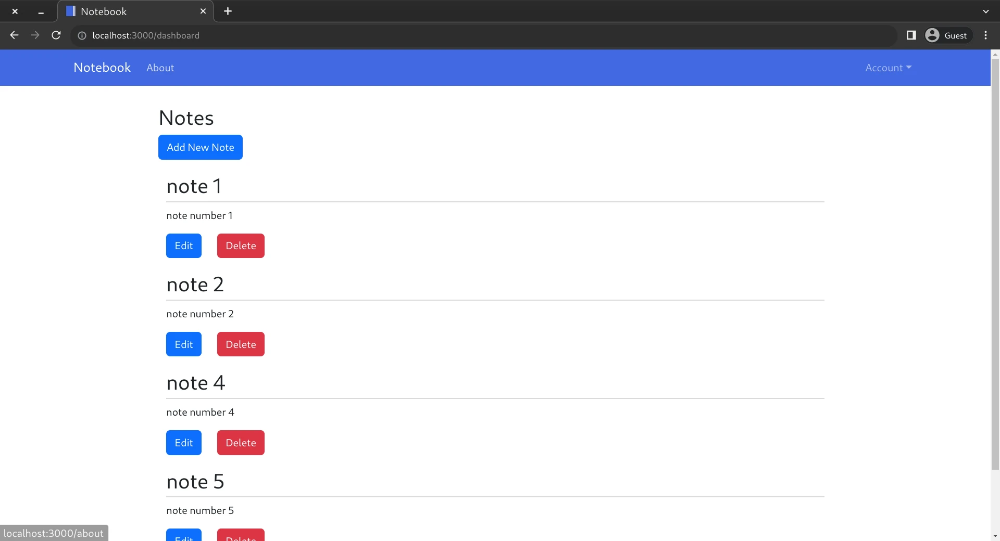

# Notebook
[](https://github.com/sagedemage/NotebookApp/actions/workflows/prod.yml)

[](https://github.com/sagedemage/NotebookApp/actions/workflows/dev.yml)



## Purpose
This is a note taking app. I create notes when learning new technologies and 
remembering what was in my mind lasted time. My goal is is to create a note taking web app 
I can use on my home server. I use raspberry pi as my home server.

## Building the Project
Go to the root of the repository
```
cd Notebook
```

Build the Docker image
```
docker-compose build
```

Start up the Docker image
```
docker-compose up
```

## Frontend:
### Frameworks:
* [facebook/react](https://github.com/facebook/react/)
	* [reactjs.org](https://reactjs.org/)

## Backend:
### Frameworks:
* [gin-gonic/gin](https://github.com/gin-gonic/gin)
	* [gin-gonic.com](https://gin-gonic.com/)

### Libraries:
* [go-gorm/gorm](https://github.com/go-gorm/gorm)
	* [gorm.io](https://gorm.io/)


