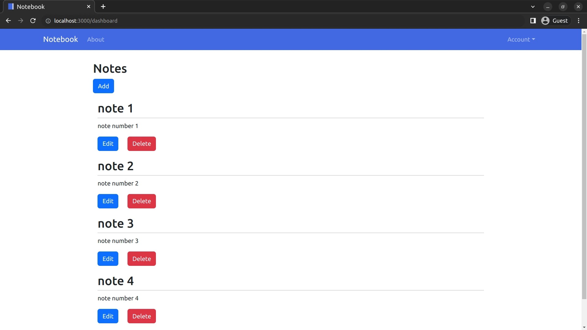

# Notebook App
[](https://github.com/sagedemage/NotebookApp/actions/workflows/prod.yml)

[](https://github.com/sagedemage/NotebookApp/actions/workflows/dev.yml)

This is a note taking app. I create notes when learning new technologies and 
remembering what was in my mind lasted time. My goal is is to create a note taking web app 
I can use on my home server. I use raspberry pi as my home server.



## Missing Functionality
It is expected that this app is not ready for production. It is missing important features for it to be complete.
The app does not have authentication for registration, login, and logout for users. 

## Building the Project
Build and Run Using Docker Compose (Option 1)
```
docker-compose build
```
```
docker-compose up
```

Quick Run (Option 2)
```
mage -v run
```
***Note***: *Look at Mage build system installation below*

## Mage build system Installation
Install Mage build system
```
git clone https://github.com/magefile/mage
cd mage
go run bootstrap.go
```
If on Linux, export the go bin direcotory
```
export PATH="$PATH:$HOME/go/bin/"
```

## Frameworks:
* [gin-gonic/gin](https://github.com/gin-gonic/gin)
	* [gin-gonic.com](https://gin-gonic.com/)

## Libraries:
* [go-gorm/gorm](https://github.com/go-gorm/gorm)
	* [gorm.io](https://gorm.io/)

## Gin Contrib
* [gin-contrib/sessions](https://github.com/gin-contrib/sessions)
* [gin-contrib/multitemplate](https://github.com/gin-contrib/multitemplate)

